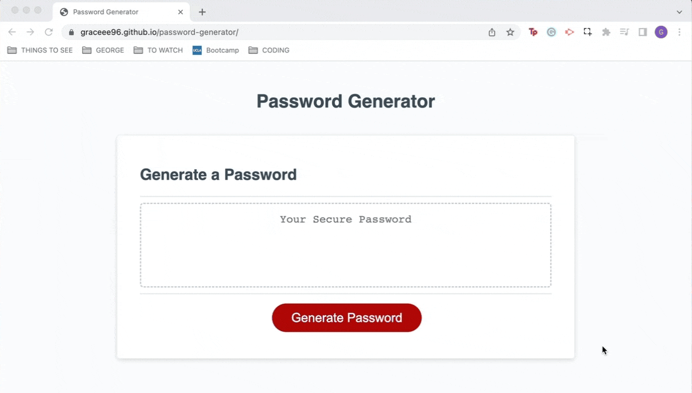

# Password Generator

## Description
This application generates a secure password based on the criteria selected by the user (length of password and type of characters to include in the password, such as letters and numbers).

## Installation
N/A

## Usage
To start, click on the Generate Password button. Afterwards, a prompt appears, asking users how long they want their password should be. Users must enter a value between 8 and 128, or else they will receive a warning message and a password will not be generated. If a user enters a value between 8 and 128, a series of dialog box will appear, confirming the types of characters to include in the password. After the last dialog box, a password is shown.

Website link: https://graceee96.github.io/password-generator

## Credit
Tutorial referenced:
* Build a Configurable Random Password Generator With JavaScript by Andy Leverenz (https://webdesign.tutsplus.com/tutorials/build-a-configurable-random-password-generator-with-javascript--cms-93262)

## License
Please refer to the license in the repository.